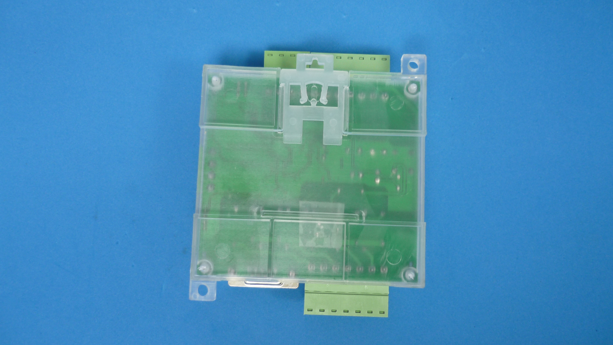
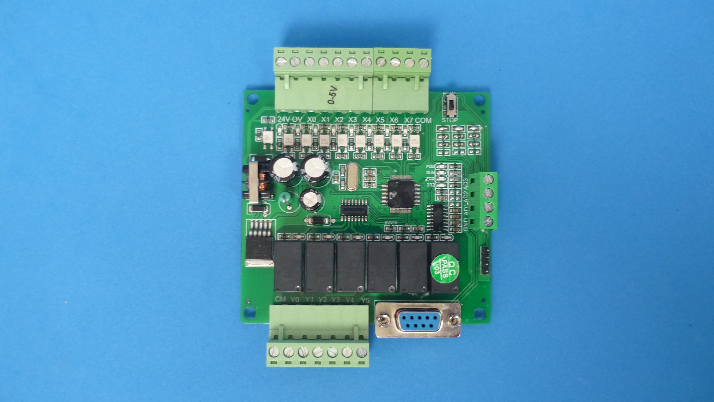
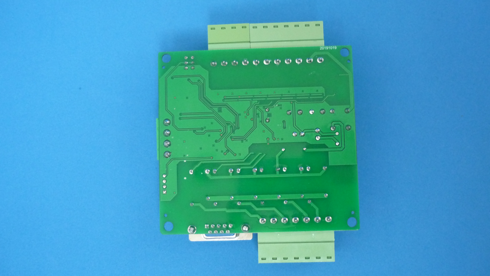
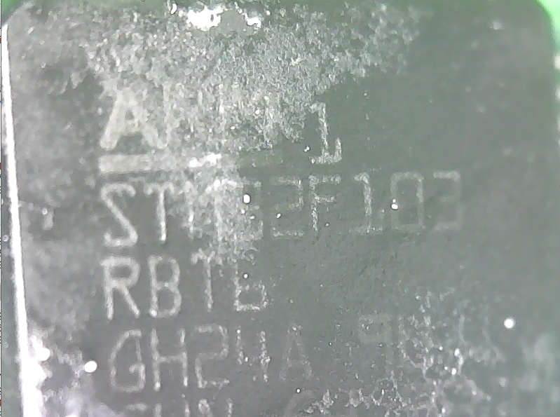

# STM32 INDUSTRIAL CONTROL BOARD

Pin mapping for STM32 based industrial control boards advertized as compatible with FX1N, FX2N, FX3U PLC software. Usually enclosed in din rail mountable enclosures.

|Upper view                    |Lower view                 
|------------------------------|--------------------------
|     | 

|Board Upper view              |Board Lower view                 
|------------------------------|--------------------------
|| 

|Proccesor part number       |
|----------------------------|
||

## Features

| FEATURE         | VALUE 
|-----------------|--------------
| Processor       | STM32F103RBT
| Power Input     | 24 VDC
| Digital Inputs  | 8 optically isolated
| Digital Ouptuts | 6 relay
| Analog inputs   | 3
| Serial port     | RS232

This boards are usually equipped with relay outputs, opticaly isolated digital inputs, RS232 serial port, 24VDC input power. Are enclosed in a convenient plastic din rail compatible mount enclosure, and screw terminals for input/outpus. This is a collective effort to document pinmaps for most common types of board available on online markets, so they will be usable with different firmware and build tools, like arduino.

## Pinout

| BOARD FUNCTION  | PROCESSOR PIN 
|-----------------|---------------
| RUN LED         | PB12
| ERROR LED       | PB13
| RS232 TX        | PA9
| RS232 RX        | PA10
| RUN/STOP SWITCH | PC9
| Y1              | PB1
| Y2              | PB10
| Y3              | PB0
